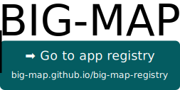

# BIG-MAP Application Registry

This repository contains the **source code** of the official App registry for the [BIG-MAP project](https://www.big-map.eu).

<p align="center">
 <a href="http://big-map.github.io/big-map-registry" rel="Go to BIG-MAP app registry">
  
 </a>
</p>

## Adding an app to the registry

Apps can be added to the registry with static metadata or dynamically fetched metadata.
Providing dynamic metadata is slightly more complicated, because it requires the app metadata to be hosted separately, e.g., in a git repository on GitHub, but it also makes it easier to update the metadata.
Here we show examples for both methods.

**Feel free to propose a new app category to be added to [`category.json`](https://github.com/BIG-MAP/big-map-registry/edit/main/categories.json) before or after adding your app.**

### Adding an app with static metadata

1. Create a pull request to this repository that changes the `apps.json` file, e.g., by clicking [here](https://github.com/BIG-MAP/big-map-registry/edit/main/apps.json) and add an entry for the app. Example:

    ```json
        "my-big-map-app": {
            "metadata": {
                "title": "MyBIG-MAP app",
                "description": "My BIG-MAP app helps to promote accelerated discovery of novel battery materials.",
                "version": "1.1",
                "authors": "A. Doe, B. Doe",
                "logo": "folder/logo.png",
                "state": "development",
                "documentation_url": "https://my-big-map-app.readthedocs.io",
                "external_url": "http://my-app.example.com"
            },
            "categories": ["quantum", "technology-ase", "technology-aiida"]
        }
    ```

    **Note**: Only the metadata fields `title` and `description` are mandatory.

2. Your app will show up in the [BIG-MAP App Store](big-map.github.io/big-map-registry") once your pull request is approved and merged.

### Adding an app with dynamic metadata

 1. Create a `metadata.json` file in publicly accessible location.

    For example, if the app source code is hosted on GitHub, you can place it within the git repository and then expose it via the `raw.githubusercontent.com` domain. Example for `metadata.json`:
    ```json
    {
        "title": "MyBIG-MAP app",
        "description": "My BIG-MAP app helps to promote accelerated discovery of novel battery materials.",
        "version": "1.1",
        "authors": "A. Doe, B. Doe",
        "logo": "folder/logo.png",
        "state": "development",
        "documentation_url": "https://my-big-map-app.readthedocs.io",
        "external_url": "http://my-app.example.com"
    }
    ```

2. Create a pull request for the app that changes the `apps.json` file, e.g., by clicking here and add an entry for the app that references the metadata file:
    ```json
        "my-big-map-app": {
            "meta_url": "https://raw.githubusercontent.com/my-org.my-big-map-app/main/metadata.json",
            "categories": ["quantum", "technology-ase", "technology-aiida"]
        }
    ```

3. Your app will show up in the [BIG-MAP App Store](big-map.github.io/big-map-registry") once your pull request is approved and merged.

### Valid keys for `metadata.json`

| Key | Requirement | Description |
|:---:|:---:|:---|
| `title` | **Mandatory** | The title will be displayed in the list of apps in the application manager. |
| `description` | **Mandatory** | The description will be displayed on the detail page of your app. |
| `authors` | Optional | Comma-separated list of authors. |
| `logo` | Optional | Relative path to a logo (png or jpg) within your repository. |
| `state` | Optional | One of<br>- `registered`: lowest level - app may not yet be in a working state. Use this to secure a specific name.<br>- `development`: app is under active development, expect the occasional bug.<br>- `stable`: app can be used in production. |
| `documentation_url` | Optional | The link to the online documentation of the app (e.g. on [Read The Docs](https://readthedocs.org/)). |
| `external_url` | Optional | General homepage for your app. |

### Valid keys for your app in `apps.json`

| Key | Requirement | Description |
|:---:|:---:|:---|
| `meta_url` | **Mandatory** | Link to the location of your app's `metadata.json` file. |
| `categories` | Optional | If provided, must be one of the valid categories specified in `categories.json`](https://github.com/big-map/big-map-registry/blob/main/categories.json). |
| `git_url` | **Optional** | Link to the source code repository. |

## Acknowledgements

The BG-MAP project has received funding from the European Union’s [Horizon 2020 research and innovation programme](https://ec.europa.eu/programmes/horizon2020/en) under grant agreement [No 957189](https://cordis.europa.eu/project/id/957189).
