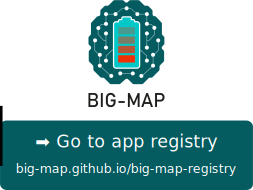

# BIG-MAP Application Registry

This repository contains the **source code** of the official app registry for the [BIG-MAP project](https://www.big-map.eu).

<p align="center">
 <a href="http://big-map.github.io/big-map-registry" rel="Go to BIG-MAP app registry">
  
 </a>
</p>

## Adding an app to the registry

Apps are added to the registry by adding an entry to the `apps.yaml` file within this repository.

*Feel free to propose a new app category to be added to [`category.yaml`](https://github.com/BIG-MAP/big-map-registry/edit/main/categories.yaml) before or after adding your app.*

1. Create a pull request to this repository that adds a new entry to the `apps.yaml` file, e.g., by [editing the file directly in the browser](https://github.com/BIG-MAP/big-map-registry/edit/main/apps.yaml?message=Add%20app%20%3Capp-name%3E). Example:

    ```yaml
    my-big-map-app:
      metadata:
        title: MyBIG-MAP app
        description: |
            My BIG-MAP app helps to promote accelerated discovery
            of novel battery materials.
        authors: A. Doe, B. Doe
        external_url: http://my-app.example.com
        documentation_url: https://my-big-map-app.readthedocs.io
        logo: https://github.com/my-org/my-big-map-app/raw/main/logo.png
        state: development
        version: '1.1'
      categories:
        - technology-aiida
        - technology-ase
        - quantum
    ```

    **Note**: Only the metadata fields `title` and `description` are mandatory.

2. Your app will show up in the [BIG-MAP App Store](https://big-map.github.io/big-map-registry) once your pull request is approved and merged.

**Tip**: The app store supports the `$ref` syntax to reference externally hosted documents.
That means you can reference metadata that is hosted at a different location, which makes it easier to dynamically update it.
For example, if you place a `metadata.yaml` file within your app repository, then you can reference that file in the app store like this:

```yaml
my-big-map-app:
  metadata:
    $ref: https://github.com/my-org/my-big-map-app/raw/main/metadata.yaml
```
You can even reference only parts of the metadata, example:
```yaml
my-big-map-app:
  metadata:
    title: MyBIG-MAP app
    description:
      $ref: https://github.com/my-org/my-big-map-app/raw/main/metadata.yaml#description

```

*The app store will assume that external references are in JSON format unless the referenced path ends with `.yaml` or `.yml`.*

### Valid keys for app entries in `apps.yaml`

| Key | Requirement | Description |
|:---:|:---:|:---|
| `metadata` | **Mandatory** | General description of the app (see below). |
| `categories` | Optional | If provided, must be one of the valid categories specified in [`categories.yaml`](https://github.com/big-map/big-map-registry/blob/main/categories.yaml). |
| `git_url` | Optional | Link to the source code git repository. |


### Valid keys for app metadata:

| Key | Requirement | Description |
|:---:|:---:|:---|
| `title` | **Mandatory** | The title will be displayed in the list of apps in the application manager. |
| `description` | **Mandatory** | The description will be displayed on the detail page of your app. |
| `authors` | Optional | Comma-separated list of authors. |
| `logo` | Optional | Url to a logo file (png or jpg). |
| `state` | Optional | One of<br>- `registered`: lowest level - app may not yet be in a working state. Use this to secure a specific name.<br>- `development`: app is under active development, expect the occasional bug.<br>- `stable`: app can be used in production. |
| `documentation_url` | Optional | The link to the online documentation of the app (e.g. on [Read The Docs](https://readthedocs.org/)). |
| `external_url` | Optional | General homepage for your app. |

## Acknowledgements

This project has received funding from the European Union’s [Horizon 2020 research and innovation programme](https://ec.europa.eu/programmes/horizon2020/en) under grant agreement [No 957189](https://cordis.europa.eu/project/id/957189).
